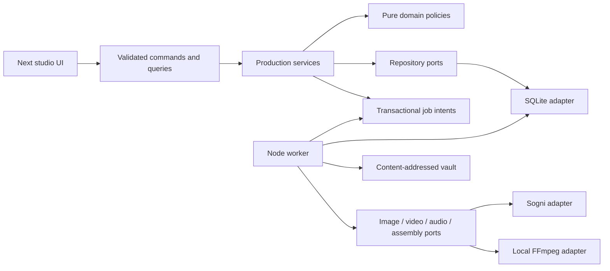

# Production architecture contract — v1

Status: approved execution design for the next increment, not implemented software. Existing verified foundation: `1bc9cf6`, 835 tests on 2026-10-03. Owner: integration architect. Task C00 freezes these contracts before workers implement them. Material contract changes require an ADR and dependent packet updates, not unilateral worker interpretation.

## Release decision and critical path

Deliver a dependable single-creator studio on one computer, with downloadable videos for manual YouTube upload. Use Next.js UI/API, a separate Node worker, local SQLite transactions and a local media vault. Upload/import narration, music and SFX is a required first-release path; generated speech/music are replaceable follow-on adapters. This removes API integration and provider-language availability from the first-export critical path. No hosted multi-user deployment, general nonlinear editor, training, or automatic publishing is required for this release.

A production release means both a reviewed 30–60 second portrait film and a reviewed 3–6 minute landscape film have been exported and reopened after a restart. Technical fixture exports alone do not demonstrate cinematic quality. A local studio is production-capable only inside its documented single-host boundary; do not deploy SQLite/disk storage on ephemeral Vercel instances or network filesystems.

Critical path: C00 contracts → C01 store → C02 revisions → C06 approval plus C04 worker → C09 audio plus C05 planning → C11 assembly → C12 review/download → C13/C14 real pilots → C15 recovery/release. UI C07/C08/C10 proceed on frozen fixture contracts before backend integration. See task registry for exact dependencies and permitted waves.

## Dependency direction and module map

| Target path | One responsibility | Dependencies allowed |
| --- | --- | --- |
| `lib/production/contracts.ts` | Versioned domain and command DTOs | Type-only primitives; no React/I/O/provider SDK |
| `lib/production/errors.ts`, `hash.ts` | Stable errors; canonical serialization and fingerprints | Node crypto only in server hash implementation |
| `lib/production/revisions.ts`, `approval.ts`, `manifest.ts`, `qc.ts` | Pure invariants and transitions | Contracts and pure helpers |
| `lib/repositories/production/ports.ts` | Store, queue, vault interfaces | Domain types |
| `lib/repositories/production/sqlite.ts`, `migrations/001.sql` | Transactions and relational integrity | SQLite driver; no provider calls |
| `lib/services/production/*.ts` | Canon/story/approval/job/audio/export commands | Domain + ports injected through constructors/factories |
| `lib/providers/production/*.ts` | Capability-specific translation, quote and result receipts | Provider SDK + neutral provider contracts |
| `lib/jobs/production/*.ts` | Lease, scheduling, submit/reconcile/poll/persist state machine | Store ports + provider ports |
| `lib/media/production/*.ts` | Probe, mix, manifest-driven encode and QC | FFmpeg/ffprobe spawned with argument arrays |
| `app/api/production/*/route.ts` | Parse request, invoke service, map stable error | Services; no direct SQL/SDK/FFmpeg |
| `components/production/*` | Visual workflow and accessibility | Typed client transport; no secrets/domain mutation logic |

SOLID application: one responsibility per module; separate speech/music/image/video capabilities; clients depend on ports; provider implementations satisfy shared conformance tests; new adapters register without changing story rules. Patterns used only where needed: Strategy (providers), Repository (store/vault), explicit State Machine (job/approval), Command + transactional outbox (side effects), immutable revisions (provenance), adapter (legacy imports). No event-sourcing platform, generic workflow DSL, microservices or dependency-injection framework.

## Fixed domain vocabulary

New IDs are server-generated opaque strings; legacy imports may preserve source IDs in an explicitly namespaced import mapping; all hashes are lower-case SHA-256 of canonical JSON. Timestamps are integer UTC milliseconds. Version is literal `1`. Frame indices/durations are non-negative integers at 24 fps; intervals are half-open `[startFrame,endFrame)`. Audio positions use integer samples at 48000 Hz. Conversion is exact: one video frame is 2000 audio samples. Do not use floating-point seconds for timeline arithmetic.

| Record | Required contents and semantics |
| --- | --- |
| Project | `id,name,profileId,activeStoryRevisionId,createdAt,updatedAt,saveVersion,takeSelectionVersion,audioMixVersion`; profile includes language/age intent, budget and format |
| CanonRevision | `id,entityId,entityKind:character|location|prop|style,revision,description,attributes,referenceAssetIds,contentHash`; immutable. Character attributes include identity/wardrobe; location includes layout/light/palette; optional voice binding references immutable audio profile |
| StoryRevision | `id,projectId,parentRevisionId|null,scriptText,beats[],canonRevisionIds[],contentHash`; beats have stable IDs and exact narration/dialogue strings |
| ShotRevision | `id,shotId,storyRevisionId,beatIds[],order,visualIntent,motionIntent,castBindings[],locationRevisionId,propRevisionIds[],styleRevisionId,framing,targetFrames,continuation:null|{previousShotRevisionId,endFrameAssetId},contentHash`; cast binding pins wardrobe and revision |
| ShotPlanRevision | `id,projectId,storyRevisionId,orderedShotRevisionIds[],beatCoverage,contentHash`; immutable aggregate. Exclusion/reordering creates a new plan and requires coverage validation and human reapproval |
| AnimaticRevision | `id,shotPlanRevisionId,slots:[{shotRevisionId,anchorId:null|id,placeholderLabel:null|string}][],timingAnnotations[],totalFrames,contentHash`; immutable timing/coverage preview approved before animation; each slot may use a labeled placeholder or available still. Timing approval does not approve any anchor; animation independently requires that shot’s exact human-approved anchor |
| AudioMixRevision | `id,projectId,storyRevisionId,cues[],mixSettings,contentHash`; immutable exact cue/media/transcript/settings snapshot; human audio approval targets this hash |
| AnchorCandidate | `id,shotRevisionId,assetId,inputsHash,jobId,visionAssessment:null|assessment`; immutable candidate, not automatically approved |
| Approval | `id,targetKind:story|canon|shotplan|animatic|anchor|take|audio|final,targetId,targetHash,decision:approved|rejected,actorId,createdAt,checklist,notes`; append-only. The local actor is a local profile, not proof of authenticated multi-user identity |
| Take | `id,shotRevisionId,anchorId,approvalId,jobId,assetId,actualFrames,inputsHash,receiptId`; immutable. Active take selection is mutable project state with optimistic version |
| AudioAsset / Cue | Asset includes source/rights/voice/text provenance; cue pins `assetId,sourceStartSample,sourceEndSample,timelineStartSample,gainDb,role:narration|dialogue|music|sfx,scriptSegmentId|null`; derive timelineEndSample = timelineStartSample + sourceEndSample - sourceStartSample. Source bounds must fit the decoded asset; integer nonnegative positions, nonempty ranges, bounded gain |
| RenderManifest | `version,id,projectId,storyRevisionId,profileId,shots[],audioCues[],captionCues[],inputsHash`; each shot pins accepted take, trim range, crop/focus and cut/fade. No live provider URLs |
| Export | `id,manifestId,jobId,assetId|null,qcReportId|null,status,createdAt`; final approval pins exported file checksum |
| Asset | `id,sha256,mime,byteSize,vaultRef,width,height,frames,fps,audioSamples,sourceKind,sourceJobId,rightsStatus`; media reference is resolved only through vault port |
| Job / Quote | See worker and budget contract below. Estimate is never represented as final actual billing |

C00 implements these in typed schemas and golden fixtures, now frozen in lib/production/contracts.ts. Project records additionally carry project-global takeSelectionVersion and audioMixVersion, initialized at0; each successful selection/mix CAS increments its respective version atomically. Manifest expectedSelectionVersion compares the global selection snapshot across all shots. API DTOs, receipt shapes and synchronous ports in lib/repositories/production/ports.ts are authoritative implementation contracts. DTO validation rejects unknown commands, invalid enums and malformed nested structures. Separate input DTOs from persisted records; callers cannot set hashes, approvals or receipts. Data format evolution requires a migration, compatibility tests and a new schema version.

## Fingerprints, dependencies and approval semantics

`contentHash` canonicalization: sorted object keys recursively, preserve array order, omit absent optional keys, reject NaN/infinity/undefined array elements, normalize strings to NFC, no whitespace or locale conversion. Hash description, attributes, ordered media checksums and schema version; exclude UI expanded state, favorite, timestamps and job progress.

`anchorInputsHash` includes shot revision hash, every selected canon revision hash, ordered reference checksums and semantic role, exact visual prompt, model/workflow/SDK-capability version, seed and image render settings. `takeInputsHash` additionally includes approved anchor checksum and approval ID, motion prompt, frame count, provider mode, all requested conditioning and audio policy. `manifestInputsHash` includes accepted media checksums/trims/order, cue content/gains, captions, format and mastering recipe version. Never trust a hash submitted by a client.

Edits create new revisions; accepted artifacts remain historical. A change to an active dependency invalidates only affected active approvals/takes/manifests and shows the reason. Sibling shots are retained. Updating a library's latest revision does not secretly replace a pinned revision; UI offers explicit **Update references** and displays affected shots. Re-exporting an explicitly selected historical manifest uses its pinned inputs and approvals; it does not silently switch to current library heads.

Approval service checks candidate media is durable/readable, target hash matches current selected revision and required checklist items are true. Story approval precedes planning; approved animatic/shot timing precedes animation; each anchor approval precedes its video job. Vision scores are advisory: failed, unavailable or exhausted vision routes to human review; never schedules animation by itself. An explicit human decision with all required checks can resolve an advisory vision warning. A rejected/stale/unapproved anchor is a hard block with no provider call.

Default cut re-anchors from its own approved still. Continuation is an explicit per-shot relation, never inferred from ordering. Changing a predecessor take invalidates only shots explicitly dependent on that end frame. A required reference never becomes optional to satisfy model capacity: choose a compatible model, split the shot, or ask creator to change the shot. In the first pilot limit cast to two characters per shot (renderer maximum three); no unsupported crowds.

## Store, migration and local runtime

Selected v1 adapter: `better-sqlite3`, version13.0.3 pinned and its native SQLite3.53.4 connection/transaction verified on Node26.10.0; C01 still implements migrations/repositories. Proposed pragmas: `journal_mode=WAL`, `foreign_keys=ON`, `synchronous=FULL`, bounded busy timeout (250ms) plus bounded application retry for a fresh write transaction. Use immediate transactions for compare-and-set job/approval writes. Transactions contain synchronous database work only; never await network/media generation inside them. SQLite WAL requires all writers on one host and still has one writer at a time. [SQLite WAL](https://www.sqlite.org/wal.html), [driver transactions/backup](https://github.com/WiseLibs/better-sqlite3/blob/master/docs/api.md).

Tables: projects; canon entities/revisions; story/shot revisions and revision-dependency edges; assets; approvals; takes/selections; audio cues; manifests; exports; jobs; job events; outbox; migration ledger. Canon relationships use revision foreign keys/edge rows, not unvalidated free-text IDs. Unique constraints: revision hash per entity, approval decision key, `(project_id,idempotency_key)` job, unique provider ref when non-null. DB writes and outbox intent commit together. Outbox consumer is the worker; leased job update requires matching lease token. Events have monotonically increasing sequence per job. Use indexes for lease eligibility and project/revision lookups.

C01 migration makes a backup of original `.studio/*.json` and a media inventory first. Import preserves original IDs, prompts, seeds, scene order, history and files; legacy completed media is explicitly `legacy-unreviewed` rather than invented approval. Import fingerprint/ledger makes rerun idempotent. Missing media/invalid rows go into an actionable import report; no silent discard, no deletion of source JSON. Old client route adapters remain until C07/C08 migration acceptance proves reopening existing work. Do not dual-write both DB and JSON as authorities.

Runtime commands to implement: `npm run studio:worker`, `npm run studio:backup -- --output <directory>`, `npm run studio:restore -- --input <backup>`, `npm run studio:doctor`. The integrator pinned tsx4.23.15 early for C01 import CLI and C04 worker; do not rely on unverified TS loading in Node20. App/worker share one configurable local data directory; health returns worker heartbeat, queue age, disk space and migration version. UI shows **Worker offline — jobs saved, waiting to resume**; never loses draft or pretends a job is rendering. Local binding defaults to127.0.0.1; mutation requests require same-origin checks. Hosted access is outside v1 and must not be enabled without authentication/storage/tenant design.

## Job state machine, ambiguity and budgets

States: `queued → validating → submitting → running → persisting → completed`. Alternate states: `blocked`, `submission_unknown`, `cancel_requested`, `canceled`, `failed`. `blocked` records reason and retry eligibility; `completed` requires local bytes + verified metadata + receipt + committed result. A job must never complete with an expiring provider URL as the asset of record.

Lease: 30-second validity, heartbeat every10 seconds. Poll provider at2 seconds initially, back off up to10 seconds with jitter; obey account limits and Retry-After. Lease loss prevents result mutation by that worker. On restart: unsubmitted intents can be reclaimed; jobs with provider refs reconcile/poll the same request; jobs in ambiguous submission cannot be auto-resubmitted. Durable request snapshots include actual resolved model/workflow, immutable references, fixed seed, quote ID and fingerprint.

Double-click/replayed HTTP submission with the same idempotency key returns the same job; conflicting body under that key returns409. Provider success followed by a crash before persisting its ref is fundamentally ambiguous unless that provider supports a durable idempotency/reconciliation key. Record `submission_unknown`, query provider by durable tag where supported, otherwise surface manual reconciliation. Do not claim exactly-once external execution or blindly retry a potentially billed job. Pre-provider transient validation/storage errors can retry; explicit conditioning drops and quality rejection need creator action, not automatic spend.

Default local worker starts with1 video,2 image,1 assembly jobs maximum, configurable downward or upward only within live account/provider limits; assembly runs separately from provider slots. Unrecognized account entitlement serializes submissions until discovery succeeds. Quote returns entitlement mode `subscription|spark|unknown`, estimate range, inputs/outputs, expiry and surcharge assumptions. User defines project and daily caps once; reuse that authorization while request scope stays within it. Unknown entitlement/expired quote/cap breach blocks paid submission, with an actionable renewal/selection dialog. No silent subscription→Spark fallback. Record reserved estimate, provider reported actual and reconciliation state separately; completed video does not prove billed actual is known.

Provider ports segregate image/video/speech/music/vision and assembly. Capability receipt distinguishes `mapped|acknowledged|rejected|unknown`; transport acknowledgment is not proof of visual adherence. Require conformance fixtures that inspect actual SDK payloads, including endpoint semantics and shared numbered-reference capacity. Ref2VA referenceImage is its first numbered image reference, not a start-frame anchor: reject required start_frame/end_frame roles unless the creator explicitly chooses a compatible endpoint workflow or changes the role to context_image. FL2VA supports either endpoint or both according to the verified SDK; FLF2V explicitly requires both. Catalog asset transport fields alone cannot prove endpoint semantics. Sogni SDK timed-keyframe controls need5.58+; the integration currently retains exact installed5.49.0 and reports timed support as blocked until an explicitly reviewed dependency upgrade verifies the request contract. Respect legal24fps H3 frame grid and live mode limits; never advertise Ref2VA or2K based only on family name.

## API contracts and concurrency

Prefix new commands `/api/production`; existing `/writer`, `/story`, `/character`, `/locations`, `/generate/*` routes remain useful entry points. C00 owns API DTOs and the error map; feature workers own only their designated route subtrees.

| Endpoint | Required request | Result / rejection |
| --- | --- | --- |
| `GET /health` | none | application schema/storage status + worker heartbeat age/availability; sanitized diagnostics, no credentials or local paths |
| `GET /projects` | opaque cursor|null,limit1–24 | project summaries (id,name,profileId,updatedAt,stage,saveVersion), nextCursor; no media bytes |
| `GET /projects/:id` | project ID | versioned read model: selected immutable canon/story/plan/animatic/mix IDs and hashes, ordered shot summaries, selected anchors/takes, approval outcomes, active jobs/export summaries and saveVersion. Historical selections stay pinned;404 unknown project; zero provider calls |
| `GET /capabilities` | provider/model IDs | discovered capability receipt with provenance and expiry; unknown stays unknown |
| `POST /quotes` | projectId,immutable input snapshot,provider/model | quote with scope, expiry, entitlement, estimate/cap checks; no paid generation |
| `POST /projects` | name,profileId | project;400 malformed |
| `POST /projects/:id/canon` | entityId,expectedRevisionId,description,attributes,assetIds | immutable revision + affected shots;409 stale |
| `POST /projects/:id/stories` | expectedStoryRevisionId,scriptText,beats,canonRevisionIds | new revision + invalidations |
| `POST /projects/:id/shot-plans` | storyRevisionId,approvedStoryHash,shots | validated ordered shot revisions;422 unknown cast/beat/missing coverage |
| `POST /shots/:id/anchors` | shotRevisionId,quoteId,idempotencyKey,renderSettings |202 job;409 stale;422 incompatible references |
| `POST /approvals` | targetKind,targetId,expectedHash,decision,checklist,notes | approval;409 stale;422 unreadable/missing required checklist |
| `POST /shots/:id/takes` | shotRevisionId,anchorId,approvalId,quoteId,idempotencyKey,motionSettings |202 job;428 missing approval;409 stale;422 capability mismatch |
| `POST /shots/:id/selection` | takeId,expectedSelectionVersion | selected take;409 stale |
| `POST /assets/import` | multipart file,kind:image|audio|video,source,rightsAttestation | durable checksummed asset; allowlisted PNG/JPEG/WebP,WAV/MP3/AAC/FLAC,MP4/MOV; max100MiB image/audio and2GiB video, bounded streaming/probe; reject MIME/decoder mismatch, traversal, arbitrary remote URL |
| `POST /projects/:id/audio` | approved asset IDs + cue list,expectedAudioVersion | immutable mix revision;422 missing media or out-of-range cue |
| `POST /projects/:id/manifests` | approved plan/mix IDs,selected take IDs,profileId,expectedSelectionVersion | immutable compiled manifest;422 coverage/trim/cue errors;409 stale snapshot |
| `POST /projects/:id/exports` | manifestId,expectedManifestHash,idempotencyKey |202 export job;428 unaccepted take/audio;409 stale |
| `GET /exports/:id/draft` | export ID only | playable review bytes or explicitly labeled Draft / QC failed download; never upload-ready |
| `GET /jobs/:id` | sinceEvent sequence optional | truthful stage, events and recovery action; never fabricate progress |
| `GET /exports/:id/download` | export ID only | final owned vault bytes only after passing QC and G09 checksum-bound final approval;428 approval required;409 failed QC;404 missing. Historical approved manifests remain downloadable |

Error envelope: `{error:{code,message,field?,shotId?,retryable,action?,details?},requestId}`. Codes are stable: `INVALID_INPUT`, `UNKNOWN_REFERENCE`, `STALE_REVISION`, `APPROVAL_REQUIRED`, `CAPABILITY_MISMATCH`, `BUDGET_BLOCKED`, `WORKER_OFFLINE`, `SUBMISSION_UNKNOWN`, `MEDIA_UNAVAILABLE`, `QC_BLOCKED`, `INTERNAL_ERROR` (sanitized HTTP 500). Client actions map code→specific recovery; clients do not parse error prose. Persisting draft with an obsolete version returns409 and preserves unsaved text locally; UI offers reopen server revision or save as new draft. Never silently overwrite another tab.

## Planning, audio and assembly defaults

One shot = one clear action/beat and camera setup. Script parser/planner must preserve approved text, beat IDs, characters, locations and narrator lines. Model text is validated JSON; unknown IDs, missing beat coverage, plot contradiction or truncation cannot pass into generation. Planner attempts at most one structured repair; then displays editable draft and errors. A human approves story meaning/shot coverage/animatic. Remove the six-scene cap; paginate at24 shot cards, queue in bounded batches, preserve stable IDs when reordered. Short pilot:6 shots ×192 frames =48 seconds. Long pilot:30 shots ×192 frames =240 seconds; detailed story outline is in fixtures. Do not loop six clips to fake a long film.

Audio-first option records/uploads exact narration before shot timing approval. Imported narration is playable and creator verifies intended transcript. Music/SFX are separately imported with source and creator rights attestation. C16 can add Sogni speech/music without changing cue/voice/assembly contracts. First release does not require lip sync; visible spoken dialogue is optional and must pass human sync review if used. Default narration-driven storybook composition is explicit, with clean cuts and moderate motion.

Manifest compilation uses selected accepted takes, integer trims and audio cues only. Defaults: cut transitions; optional approved8-frame crossfade subtracts overlap from total. Missing source duration, invalid crop, source shorter than requested trim or out-of-range cues block compilation. Quantized provider output may be trimmed to approved shot length; padding/looping/freeze is never silently introduced. Longer action requires another approved shot, not arbitrary time stretching.

Export recipe v1:1080×1920 portrait or1920×1080 landscape,24fps progressive,H.264 High,yuv420p,CRF18,preset medium,`+faststart`; AAC-LC stereo48kHz192kbps; SDRBT.709, square pixels. Normalize each source to fit/crop as approved; label upscaled sources. No black bars in portrait by default. Music starts at-22dB gain, SFX-12dB, narration0dB as starting mix, then user audition adjusts. Sidechain duck music under speech (ratio6,attack20ms,release250ms) and measure two-pass loudness to-14LUFS±1,-1dBTP maximum. These are product defaults, not mandatory YouTube rules. Use actual full-mix QC and human listening; do not normalize per-line and assume final sum is safe. [YouTube encoding](https://support.google.com/youtube/answer/1722171?hl=en), [FFmpeg filters](https://ffmpeg.org/ffmpeg-filters.html).

Assembly worker downloads no arbitrary URL: resolve internal asset IDs, validate checksums/probes, stage files in bounded temporary directory; invoke FFmpeg using argument arrays. Cancel terminates child process and cleans staged files; source vault remains untouched. Complete after file and QC report are durable. Reuse requires unchanged manifest, recipe and toolchain hashes plus durable checksum-verified bytes and a passing compatible QC report. Failed or incomplete output cannot be reused as a successful export. Download filename includes project slug, profile and export version; UI plays the exact downloadable bytes.

## Compatibility and change control

Production mode is the new explicit project workflow. Existing solo/free/demo generation remains best effort unless conditioned requests request strict behavior already implemented. Imported legacy records are reviewable; no fake approvals. Existing automatic keyframe gate must not run the new production scheduler; C04/C06 own cutover and adapter boundaries. Old story preview is labeled preview, never upload-ready. Shared files (`package.json`, lockfile, provider types, legacy runner/executor, global styles/nav) have one integration owner. A worker proposes patches for shared files; integrator lands them in dependency order and runs regression checks. `TASK_PACKETS.md` defines ownership for every implementation packet.

## Future SaaS boundary

Local v1 is the fastest credible production workflow, not a deployed multi-tenant SaaS. Keep application use cases and domain schemas independent of filesystem/SQLite/provider implementations so hosted repositories, object storage and remote workers can be added through ports. Before a hosted release, a separate reviewed milestone must add authenticated workspace membership, tenant isolation across every query/job/asset/download, secret encryption, quota/billing enforcement, audit/retention/deletion rules and restore/load tests. Do not expose this localhost server publicly or treat a local actorId as authentication. The professional interface and genre-neutral navigation are ready to extend; hosted security and account billing remain explicit future work.

Shared server composition is implemented by I00 before C02/C04: runtime.ts owns lazy local-store lifecycle/configuration, profiles.ts owns injected immutable project-profile defaults, and http.ts owns bounded JSON/same-origin/error boundaries. Services continue to receive explicit ports. C04 owns the separate production Sogni adapter and its conformance tests; SDK connections must not displace the legacy client or each other through a shared appId. No provider connection belongs in module import or a SQLite transaction.

### ADR: canon-only story successors and derived read response v2 (2026-10-03)

Persisted records remain version 1. ProjectReadModel is response schemaVersion 2 with required dependencyIssues. Issues identify targetKind/targetId, dependencyKind, pinnedDependencyId, activeDependencyId (null when missing), and DEPENDENCY_REPLACED/STORY_CHANGED/DEPENDENCY_MISSING. These are derived from current selected snapshots; never stored approval flags. Historical manifests validate their own pins. The error enum adds INTERNAL_ERROR; unexpected server failures use sanitized HTTP 500, while known application errors retain field/shotId/action/details.

Changing a project's canon binding is explicit CAS against that project's selected entity revision, never the library head. Other projects retain their pins. Keep existing plan/animatic/take selection pointers for comparison and historical access; derive stale state. A story successor with new canon pins always needs a new genuine human approval. Do not copy approvals.

ShotRevision.storyRevisionId records its immutable originating story. A new plan may reuse the exact previous ShotRevision across stories only when originating and target stories belong to this project, scriptText and the complete ordered beats are byte-equivalent (including exact narration/dialogue/action), every shot input field and order is identical, and every canon pin used by the shot remains selected in both current story and project. Continuation asset and predecessor pins must be identical and valid. Recompute proposed shot content using its originating story ID solely for comparison against its existing hash; never change stored provenance. Any script/beat edit conservatively blocks cross-story reuse. New plans/animatics always require their own approval.

Downstream approval, take and manifest checks require membership in the selected plan plus this explicit compatibility predicate; blanket originatingStoryId === activeStoryId is insufficient. Each dialogue-bearing beat requires coverage by a shot containing its speaker; off-screen voice is not supported in this increment. Shared library canon is reusable across projects; foreign project story/plan state is rejected. Canon selection requires a revision of the correct entity kind, unique entity bindings, and a character pin for every dialogue speaker.

C02 owns the targeted C05 service amendment and tests. Required regressions: genuinely approved canon-only successor replaces affected shot while preserving exact unaffected shot/hash/anchor/take/selection IDs; unapproved successor fails; same text with changed beats or dialogue fails reuse; no missing/foreign parent or duplicate bindings; explicit continuation invalidation; SQLite reopen retains history and derived issues; CAS failure rolls back inserts. C06/C11 consume the same exported pure compatibility predicate. No SQLite migration or provider call is required by this ADR.

### ADR: budget authorization and accounting prerequisite

I01 follows accepted C02/C04 and precedes paid C06 submission. Quote.withinAuthorizedCap is advisory at quote time, never final authorization. Separate immutable standing authorization and durable reservation/billing ledger enforce account-wide UTC daily and project caps atomically before provider I/O. Unknown entitlement/currency/upper estimate/account identity blocks. Reservations survive uncertain acceptance, cancellation and restart until affirmative billing reconciliation. Actual billing is independent of media completion; repeated reconciliation is idempotent. SDK entitlement and exchange evidence remain unknown unless observed; subscription must not be priced at invented zero. Minimal budget controls belong to C07. No paid job is authorized merely by completing local fixture tests.

I01 uses one versioned account-wide daily policy per provider account/currency/unit, referenced by project authorizations, not competing per-project daily caps. Standing authorization has explicit nullable expiry; revocation is checked at atomic reserve+submitting commit. Stable fresh account evidence binds credentials/connection, quote and reservation. Trusted reconciliation facts have append-only provenance and unique event keys; browser commands cannot fabricate billing or refunds. Known actual replaces reserved liability once; overrun is recorded and blocks new submissions when current caps are exceeded. All scope/currency/unit arithmetic is explicit and overflow-safe. Detailed normative tests are in I01 TASK_PACKETS.

Outbox acknowledgement consumes only a matching current unexpired intent; it never deletes job/event history. C02 owns the narrow shared-port/store amendment during its active wave, and C04 consumes the reviewed prerequisite commit. Worker queue claims one intent at a time, acknowledges terminal rows, and retains recoverable intents. Test more than100 historical terminal intents followed by new queued work to prevent starvation.

I02 implements script/storyboard proposal generation through an explicit text-planning adapter, separate from H3 video rendering. Proposals are editable unapproved data, never selected immutable records or media jobs. Exact source-range speech reconstruction and strict selected canon/beat IDs enforce mechanical consistency; human review assesses plot and staging. One bounded repair, then visible failure. Long drafts use complete bounded chunks rather than truncation. I01 must explicitly cover any charged text operation; absent verified text pricing/entitlement blocks a real call while manual editing remains usable. C07/C08 wire proposal controls to the accepted service.

### ADR: durable worker result and lifecycle seams (scheduled resume, 2026-10-03)

C04 review of checkpoint036afc8 found missing result records and lifecycle races. This amendment is an execution requirement, not accepted implementation. Keep C04 incomplete until these behaviors are independently reviewed. Existing v1 records and one production.sqlite remain authoritative; no second queue database.

- Renew the owned outbox claim and job lease in one short transaction. heartbeatOutbox(intentId,claimToken,now,leaseUntil) updates only a matching claim whose previous deadline is strictly greater than now; never resurrect an expired claim. Roll back both renewals if either fails. Avoid repeatedly reclaiming busy oldest intents; use bounded scheduling and 2–10 second provider polling backoff with jitter.
- requestJobCancellation(jobId,expectedStatus,requestedAt) performs an unleased status CAS to cancel_requested while preserving lease, provider reference, receipt, immutable request and existing result history. Never change a terminal state. Caller appends the event in the same transaction. First successful terminal CAS wins. Before submit/poll/result commit, read current status. Unsubmitted cancellation performs no submit; accepted requests cancel/reconcile the same provider reference. Acknowledgement racing cancellation must retain the returned reference/receipt while keeping cancel_requested, rather than losing acceptance identity.
- Freeze a strict server-owned ProviderResultTarget: anchor {kind,shotRevisionId,inputsHash} or take {kind,shotRevisionId,anchorId,anchorApprovalId,inputsHash}. Add it as a compatibility-preserving optional member of the durable ProviderRequestSnapshot, required for actual anchor/take submission. C06 supplies these immutable targets from validated commands. Missing/foreign/mismatched targets fail before paid I/O. Revalidate exact selected plan/story compatibility and human approval pins before submission; on completion preserve the submitted provenance even if the active story later changes, exposing the result as historical/stale rather than rewriting it.
- A completed anchor job inserts Asset plus AnchorCandidate with visionAssessment:null and existing receipt ID. A completed take inserts Asset plus Take pinning the exact existing anchor approval and measured frames/receipt. All result rows and the completed job commit in one lease/status-checked transaction, or none do. resultId is the anchor/take record ID, never the media asset ID for those operations. Completion does not create or copy a human approval or auto-select a take. C04 requires the exact durable receipt before completion; a recovered provider reference alone is insufficient. Unknown submission requires durable operator reconciliation with recorded receipt evidence, never automatic resubmission.
- Snapshot billingMode is explicitly subscription or tokens, derived from the fresh authorized quote/account evidence by the server, never auto. The adapter must transmit it unchanged and reject a mode conflicting with authorization. I01 remains the mandatory atomic reservation boundary; these fields alone do not authorize spending. CLI readiness distinguishes running scheduler/storage, provider connection and budget authorization. A safe blocked default is not an operational paid pipeline.
- Provider role mapping follows ordered role occurrences even when the same asset ID supplies multiple roles; plural reference fields use ordered arrays. Real discovery combines live exact-model availability with verified installed SDK constraints and reports absent facts as unknown. Worker lock ownership must survive crash/restart safely without stealing a live owner. A transient catalog failure is recorded/recoverable, not an uncaught scheduler shutdown. Media validation includes actual decode and bounded metadata extraction, not magic bytes alone.

Shared schema and store amendments are assigned by the integrator and reviewed separately before C04 consumes them. C02 remains the sole writer for ports/SQLite until its assigned checkpoint is delivered. C06/I01 consume these reviewed seams; do not mark their dependent behaviors implemented from this ADR.

Worker semantic fingerprint recipe v1 (C04/C06 shared): computeProductionInputsHash resolves immutable records through the read port and hashes {recipeVersion:1, operation, shotContentHash, canon:[ordered cast/location/props/style revisionId+contentHash, deduplicated in first-use order], references:[ordered role+required+assetSha256], providerId, modelId, prompt, parameters, billingMode, anchor:null-or-{anchorId,checksum,approvalId,approvalTargetHash}}. Exclude jobId, idempotencyKey, quoteId and the target's own inputsHash to avoid identity churn and self-reference. Missing records fail closed. Parameters preserve model/workflow/SDK recipe controls; capability observation timestamps/job progress are not semantic inputs. C06 and C04 must call the same exported helper, never create separate formulas. Compare a target hash to this server-derived hash before submission. Completion resolves submitted pinned provenance, allowing a later active-canon edit to leave an explicitly historical result; never silently rewrite inputs or auto-select the result.

Canonical normalized fingerprints are not a uniqueness key for exact raw source strings. Story/shot input equality additionally preserves supplied script, spoken lines and shot text byte-for-byte. New byte-distinct shot rows may share a normalized hash; only their IDs are unique. Existing stored shot rows and natural keys remain unchanged/readable, with no migration001 rewrite.

Anchor approval fingerprint recipe v1: computeAnchorApprovalHash(read,anchor), exported from the C04 queue module and reused by C06, hashes {recipeVersion:1,anchorId,shotRevisionId,inputsHash,assetSha256}. Resolve the anchor asset through the immutable read port; missing media metadata fails closed. This binds the actual candidate bytes as well as its recipe without including timestamps, vision assessments or job progress. The take target pins an approved human record for this exact hash. Require the latest valid decision before submission; once accepted, completion retains that exact historically approved pin even if a later decision rejects the candidate. Completion never implies selection or present-day acceptance.

Explicit unknown-submission recovery uses a trusted full ProviderSubmissionAck, not a browser-supplied receipt or a provider reference alone. While holding the existing job lease, persist the verified honored-input receipt, known provider reference and reconciled state, plus ensureOutbox for that existing job in one transaction. ensureOutbox never replaces an existing claim and never creates a job. Reopen polls the same accepted provider reference; recovery must make zero new submit calls. Missing provider evidence remains an actionable unresolved state.

### ADR: shared fail-closed approval decision policy (2026-10-03)

C04’s G04 submission boundary must prove the selected story and animatic have current human approvals before any provider call. Read the project’s active story, shot plan and animatic; require exact current relationships, shot membership and animatic slot membership. For each approval, match exact target kind/id/contentHash, choose the maximum createdAt, and require at least one latest decision with every tied latest decision approved. Do not add a shot-plan approval prerequisite in this increment. Capture the selection and approval IDs/hashes before async capability and budget authorization; resolve them again immediately before beginSubmission/provider I/O and require the same IDs/hashes/decisions. This check does not create approvals or implement approval commands.

The pure helper is lib/production/approval-policy.ts, owned by C04 and consumed later by C06. It evaluates append-only approval records only; persistence and human decision commands remain C06 responsibilities. This resolves the sequencing gap where G04 was required in C04 before C06 command services exist. Never auto-approve a story or animatic to enable rendering.

## I01/C06 prerequisite sequencing amendment — 2026-10-04

Code inspection found that I01 live quote composition needs the complete server-validated request recipe, while C06 was listed after full I01. A quote input projection lacks prompt, conditioning roles and anchor approval pins, so it cannot substitute for that recipe. After B3/B4 finance kernel review and integration, the integrator may dispatch a narrow C06-PRE slice to implement human approvals and the canonical anchor/take recipe plus enqueue commands. It uses the existing exported semantic hash and approval helpers; paid composition remains absent and submission fails closed. This is a prerequisite subset, not acceptance of either parent packet.

I01-B6 then consumes that exact C06 recipe for durable account/quote proof composition. Full I01 and C06 acceptance still requires their remaining tests, independent review and integration gates. No duplicate B6 recipe builder, inferred approval, or paid call is authorized by this sequencing change. Proposed proof archive ports/migration and credential-generation rules in reports/I01-B6-composer-proposal.json remain proposals requiring a concrete shared boundary review. Audio import remains the first-release path; generated audio adapters stay separate.

### C06-PRE approved boundary — 2026-10-04

After accepted B4 kernel e2624d7, reports/C06-PRE-root-freeze.json is normative for this prerequisite slice. Migration003 removes approval decision tuple uniqueness while preserving historical IDs/keys/FKs; new deterministic command IDs become future approval natural keys. Real UTC decisions must strictly follow previous target decisions, otherwise409 retry. Human checklist, immutable media hashes and exact historical replay remain explicit. Trusted billing intent is separate from observed entitlement/permission; absent resolver fails closed. One authoritative takes service builds the server recipe using existing semantic/approval helpers for both quote and enqueue; B6 consumes it. No paid composition, final QC, UI redesign or full parent acceptance is claimed. Future unapproved B6 proof migration must be004or later.
