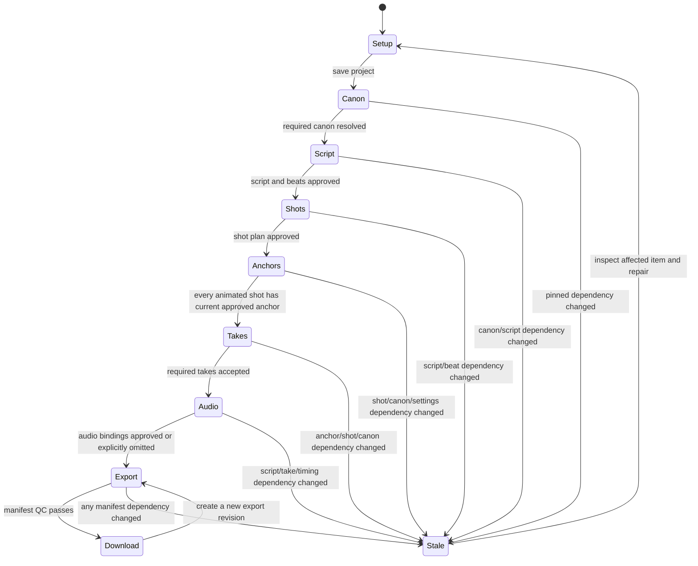

# Production Studio UX specification

**Commercial product direction:** This is a professional, genre-neutral creator studio suitable for future SaaS positioning. Preserve the established DESIGN.md palette and editorial typography, with restrained accents, clear hierarchy, precise action labels and generous media space. Kids content is a project profile and demo subject, never the interface theme. Avoid playful mascots, cartoon chrome, gamification, gradients used as decoration and exaggerated success claims. Advanced provenance/model controls live in an optional inspector; the main flow uses plain production language. Do not add fake cloud/account/billing controls before those capabilities exist.

**Status:** implementation-ready product and interaction contract for the first solo creator release. This document specifies UI behavior; it does not claim the underlying production records, worker, approval service, narration pipeline, or mastering flow already exist.

## Product contract

Production Studio turns one project into an approved short or long video through one inspectable sequence: project setup → canon and assets → script and approved beats → shot plan and animatic → keyframe contact sheet → animate accepted keyframes → review takes → narration/music/SFX mix → export and QC → download. A one-shot Solo project follows exactly the same records, approvals, and render route with one shot. It is a shortcut into the shared pipeline, not a separate generation path.

The intended creator is one person working locally in a browser. Persist project revisions, uploaded and generated asset references, job states, review decisions, and exports on the local installation so browser close/reopen and worker restart can resume. The interface must make this local durability scope explicit in setup/help copy; it must not imply cloud sync, multi-user collaboration, or YouTube publishing. YouTube is a manual next step after download.

The core promise is user control over canon and provenance, not guaranteed model fidelity. A generated image/video is a proposal until its specific revision is explicitly reviewed. No generation result, score, timeout, batch command, keyboard shortcut, or retry can approve on the creator’s behalf. Approval binds to a stable hash of normalized inputs and their versions. A dependency edit marks downstream approvals/outputs stale while preserving their history; stale or unapproved keyframes cannot animate and stale inputs cannot export.

## Existing product and migration

Keep the existing Next.js desktop-web app, SiteChrome navigation, `components/ui.tsx` controls, `MediaFrame`/`VideoStage`, `StoryPlayer`, asset/library patterns, and CSS variables in `app/globals.css`. The current visual language is editorial and image-led: warm paper canvas, raised surfaces, evergreen primary actions, clay accents, serif display headings, Inter/system sans body, fine borders, restrained shadows, compact status labels, and persistent left rail. Reuse semantic tokens (`primary`, `accent`, `ink`, `muted`, `canvas`, `surface`, `raised`, `border`, `success`, `warning`, `danger`) and existing type/radius/spacing scales. Do not introduce a parallel palette, font family, or dashboard-card visual system. Media stages may use a dark neutral background for contrast.

| Existing route / component | Production destination and behavior |
| --- | --- |
| `/` | Add a primary “Production Studio” entry leading to `/production`; preserve the current Image, Motion, Story, and world-building entry points. |
| `/writer` (`WriterView`) | Keep the standalone writer available. “Use in production” creates/opens a project’s Script & Beats step and carries the selected draft as a new source revision; it never silently overwrites a project script. |
| `/story` (large scene composer/player) | Keep for existing story assets and backward compatibility. Add “Continue in Production” to import/attach a story as a project draft with explicit preview of cast, place, scene count and unresolved canon IDs. Do not treat its current scene/player state or automatic vision gate as human approval. Production projects deep-link to their own Script, Shot Plan, and Review routes. |
| `/generate/image`, `/generate/video` | Remain independent image/motion tools. “Send to Production” creates a one-shot project with the selected prompt/settings and imported references, then enters Canon/Shot review; generated outputs are unapproved anchors/takes. |
| `/character`, `/character/[id]`, `/locations`, `/images`, `/stories`, `/results` | Existing reusable libraries stay available from production asset pickers and sidebar. Selecting a library item pins its exact asset revision/hash into the project; later library changes leave the pinned revision valid. An explicit Update references action creates new project revisions and shows precisely which approvals become stale. |
| `/settings` | Retain provider/model configuration. Production step displays only settings compatible with the active strict reference policy. No silent provider/model fallback. |
| New `/production` | Project list and “New production” entry. |
| New `/production/new` | Project setup wizard; saves a draft immediately before leaving setup. |
| New `/production/[projectId]` | Project overview, activity, saved state, current step, stale/failure/recovery summary. |
| New `/production/[projectId]/canon` | Pinned cast, wardrobe, locations, props, reference assets, version and missing-ID resolution. |
| New `/production/[projectId]/script` | Script editor and explicit beat approval. |
| New `/production/[projectId]/shots` | Ordered shot list, beat mapping, timing, framing, reference and continuity controls; animatic preview. |
| New `/production/[projectId]/anchors` | Contact sheet, source/provenance details, per-image approve/reject/edit/replace. |
| New `/production/[projectId]/takes` | Shot-by-shot animation submission and take review. |
| New `/production/[projectId]/audio` | Narration, voice lock, music/SFX cues, timeline and mix preview. |
| New `/production/[projectId]/export` | Profile, manifest readiness, export jobs, QC report, preview and downloads. |

The project shell uses a stable project ID and revision identifiers in the URL. Opening a project restores its last visited step when valid; otherwise show the overview. Routes are directly loadable and browser back/forward works. Unsaved text is autosaved locally and navigation never discards it silently.

## Navigation and global shell

Desktop retains the current full-height left rail (collapsible using the existing preference) with Make, Collect, and Build a world groups. Add “Production” under Make. Inside a project, show a project header (name, local-saved state, active revision) and a vertical numbered workflow navigator. Each step has a text state: Not started, Draft, Needs review, Ready, Running, Attention, Stale, Complete. Never communicate these states by color alone. Selecting a locked future step opens it read-only with the specific prerequisite and a link to fix it; it does not dump the user at an unexplained disabled control.

The content column is bounded to a readable desktop width. Review/shot pages use a two-column work surface where practical: primary media/canvas and queue on the broad side, selected item details/actions on the other. Keep primary action visible at the top of the task surface and repeat it in a sticky footer only when the work area scrolls. Avoid nested scroll panes except a deliberately bounded contact sheet or timeline with clear focus and scroll ownership.

Use calm, familiar creator language in navigation and headings. The internal terms “manifest”, “capability”, “hash”, “worker”, “idempotency”, “stale dependency”, and “QC” belong in details/help where relevant, not as primary step labels. Prefer “What changed”, “Reference check”, “Saved on this computer”, “Review video”, and “Export check”. Every view has one visually dominant next action and one sentence explaining what happens when it is used. Progress is a numbered journey with the current step, completed steps, and the next requirement; never use a generic percentage for workflow completion.

### Annotated layout sketches

Desktop review, 1440px wide:

```text
┌──────────────┬─────────────────────────────────────────────────────────────────────────────┐
│ PeraByte     │ Fern & the Lantern   Saved on this computer · Story revision 4              │
│ Make         │ 1 Setup — 2 Story — 3 Shots — 4 Review — 5 Finish                            │
│  Production  │                                                                             │
│ Collect      │ Review your key images                            3 of 8 need a decision     │
│ Build world  │ Approve each image you want to bring to life.                                │
│              │                                                                             │
│              │ ┌───────────────────────────────┐ ┌──────────────────────────────────────┐ │
│              │ │ Contact sheet: 2 × 3 cards    │ │ Selected image · Shot 03             │ │
│              │ │ [approved] [selected] [pending]│ │   large illustrative media stage     │ │
│              │ │ [pending ] [rejected] [pending]│ │ Story + pinned character/place refs  │ │
│              │ │                               │ │ Reference check · All 3 included     │ │
│              │ └───────────────────────────────┘ │ [Approve image]   [Ask for a new one] │ │
│              │                                   └──────────────────────────────────────┘ │
│              │                                                                             │
│              │ Next: approve each image before creating its moving version.                 │
└──────────────┴─────────────────────────────────────────────────────────────────────────────┘
```

At 375px the rail is a top bar/drawer; journey steps are a horizontal scroll-free labelled selector; the selected image stage appears first, the pinned reference strip follows, contact cards form a two-column grid, and the bottom action bar remains reachable without covering the selected image or its status. A card tap selects it; approve/reject actions stay in its detail panel so a fast tap on the image cannot accidentally approve it.

Project workflow desktop:

```text
┌──────────────┬─────────────────────────────────────────────────────────────────────────────┐
│ Studio rail  │ Project name · Saved locally · Short video                                   │
│              │ 1 Project ✓  2 Story ✓  3 Shots •  4 Review  5 Finish                       │
│              │ Give this scene a clear beginning.                                           │
│              │ ┌──────────────────────────┐  ┌──────────────────────────────────────────┐ │
│              │ │ Story / beat list        │  │ Selected shot                             │ │
│              │ │ Beat 1 • approved        │  │ prompt / framing / duration               │ │
│              │ │ Beat 2 • needs a place   │  │ Character reference  Place reference      │ │
│              │ │ + Add a beat             │  │ [Choose reference] [Independent cut ▾]    │ │
│              │ └──────────────────────────┘  └──────────────────────────────────────────┘ │
│              │ [Back]                                  [Save and continue to shot plan]     │
└──────────────┴─────────────────────────────────────────────────────────────────────────────┘
```

These sketches establish hierarchy and behavior, not exact pixel rendering. “Reference beside shot” means the selected shot’s cast/place/prop thumbnails and their included/missing state are in the same visible review panel as its image or video at desktop widths; on mobile those references appear immediately after the preview and before decision actions.

Mobile keeps the same routes and information order. Replace the rail with existing compact top bar and drawer. The workflow navigator becomes a labelled step selector/progress list; media and details stack vertically. Sticky action bars must leave content visible and reserve safe-area padding. Do not require drag, hover, horizontal swipe, or pixel-precise interactions. At 375px there is no horizontal page overflow; shot rows become stacked cards and comparison controls become explicit Previous/Next buttons.

## Project states and workflow transitions



Steps are individually saved and revisable. Advancing requires the step’s explicit completion contract, not merely field validity. Users can revisit earlier steps; on save, show exactly which descendant objects became stale, preserve old approvals and media, and provide “Review affected items” navigation. If the edit does not change normalized hashed inputs, retain approvals and say “No downstream items changed.” Never auto-reapprove after an edit.

Creation source offers **Story project** and **One-shot video**; both converge after setup. Short profile defaults to 9:16 / target 30–60 seconds; Long defaults to 16:9 / target 3–6 minutes. Profiles share shot/take/audio/manifest records. Exact codec, fps, captions, safe-area and audio technical settings are versioned profile implementation decisions, not invented controls in this UX. If unresolved at runtime, show the profile’s supported values and block export with a named configuration issue rather than implying a valid preset.

## Shared job, persistence, and approval behavior

All long work is an asynchronous local worker job. A command returns a durable job ID before the UI shows it as queued. The job panel reports Queued, Preparing, Running, Saving output, Complete, Failed, Cancel requested, Canceled, or Needs attention; include step name, affected item, elapsed time, progress only when grounded in worker events, and last update time. No fabricated percentage/ETA. Polling/reconnect updates a polite live region without stealing focus. Browser reload recovers from persisted state.

Every form indicates **Saving…**, **Saved locally at [time]**, or **Save failed — Retry**. Debounced autosave is for editing only; action submissions are explicit. Keep a local draft after failed writes and expose retry. A dirty unsaved snapshot disables dependent generation/approval/export commands with the reason “Save changes before …”. On worker failure retain inputs, prior takes, and partial artifacts marked incomplete; show sanitized cause plus Retry/Cancel/Inspect. Retry is idempotent for the same intent and shows whether it reuses/reconciles a provider job or starts another attempt; never hide possible duplicate cost.

Approval controls are always item-level. Bulk actions may queue, cancel, or navigate through items; no bulk approve. “Approve selected anchor” confirms the displayed source hash/revision; apply the approval immediately to only that image. For faster review, after approval focus moves to the next unreviewed item and announces “Shot 3 anchor approved; shot 4 of 12 needs review.” Reject requires a reason from a compact menu (identity, wardrobe, location/layout, prop, beat mismatch, composition, other) and optional note; reason is editable. Rejected assets remain in history. An edit/re-generate action states which inputs change and which approvals will stale.

Strict canon/reference validation happens before any provider call. A missing or unknown character/location/prop ID appears inline at the source row, with “Choose existing asset”, “Create asset”, or “Remove from shot” resolution; never silently drop it. Reference capability mismatch names the unhonored input and model, explains it cannot be weakened, and provides supported model/settings choices. If optional omission is allowed by policy, disclose it before submission and require a deliberate choice. Cost/entitlement estimates show source, expiry, assumptions, project authorized cap, and actual reported spend after completion. A stale quote, missing entitlement, exceeded cap, or unsupported capability blocks submission and gives the actionable next step; no automatic paid fallback.

## Screens, fields, actions, and states

### Project list and setup

`/production` lists projects by recent activity with title, short/long badge, current step, saved/attention state and last opened time. Search and sort are adjacent to the list. Empty state explains the same flow supports a single clip or a complete story and offers **New production**. Load uses stable row skeletons; load failure offers Retry without clearing locally cached rows.

Setup fields: project title (required, visible label), format (Short/Long), source type (Story/One shot), working language (creator-selected; generated text/speech choices separately require verified model support), target duration/profile summary, local media folder/storage location summary if configurable, and age/content profile if product has a defined policy. Do not invent age bands or claim child safety: show the default ages 5–8 English pilot intent clearly and allow the creator to change it; require creator content review, without suggesting provider filters certify child safety. Create saves a setup draft and routes to canon. Cancel returns to list without deleting. Existing draft reopen resumes. Duplicate title is allowed; project ID is the identity.

### Canon and assets

Organize as Cast, Wardrobe, Places, Props, and Additional references. Each row shows pinned thumbnail, display name, local library asset and revision, hash/status, role and whether required for this project. Fields support select/import/upload, crop/primary reference choice, wardrobe notes, location layout notes, prop identity notes, and per-shot required/optional designation where policy supports it. Upload shows file name, type, byte size, progress, validation result and retry; reject unsupported/oversized files inline before use. Missing image loads have an explicit unavailable placeholder and reselect action.

Actions: Add from library, Import file, Edit project notes, Unpin (with dependent stale warning), Add cast/place/prop, Continue to Script. Reordering is available by labelled Move up/down buttons in addition to drag. Continue is disabled until all explicit IDs resolve and at least one required visual reference exists for each canonical entity assigned to a shot. State banner lists each blocker and link; no blanket “invalid project”.

### Script and approved beats

Use a broad manuscript editor with title, premise, audience intent, language, script text, and beat outline. Beat rows have stable beat ID/order, concise beat text, cast/place IDs, story purpose, age-policy validation status and approval revision. AI-generated/revised text enters as a proposal in a comparison/diff view; user must accept it into a new script revision, then approve beats. Never overwrite the prior revision or claim model authorship as fact. Text autosaves locally and indicates saved revision/hash. Validate before approval: empty beats, unresolved IDs, beat with no purpose, unsupported cast/place IDs, and policy violations show inline with focus to first issue.

Actions: Save draft, Generate/Revise proposal, Accept proposal, Approve script & beats, Revert to prior revision. Approval binds to exact script and canon hashes; edits produce “Approval stale: script changed” with prior approval/history inspectable. Generation disabled while unsaved changes exist, script empty, provider/language unsupported, or required quote/capability unavailable; show the exact reason adjacent to action.

### Shot plan and animatic

Ordered shot list rows show shot number, linked beat, intent, cast/place/props, framing, camera move, continuity mode (Independent cut by default; Continue from previous is explicit), target duration, reference summary, status, and version. Long story plans support pagination/chunked bounded batches rather than a fixed six-shot assumption. Fields are editable in a focused inspector; add, duplicate, remove, and reorder actions are explicit. Duplicate creates a new shot ID with copied references and fresh status, never copies approvals. Removing a shot requires confirmation and identifies downstream timing/beat consequences.

Show validation for unlinked beats, omitted beats, invalid ID, over-budget duration, missing required anchor reference, and impossible provider timing as distinct rows. Animatic uses approved story text and placeholder stills/available approved images, with keyboard-operable play/pause, previous/next shot, captions/transcript, and per-shot duration. It is a planning preview and is labelled **Animatic preview — not rendered video**. Approve shot plan is disabled until every beat is mapped or explicitly marked non-visual, every shot validates, and total/profile timing is in range. Plan approval snapshots its hash; changes mark anchors/takes/audio/export stale according to dependency links.

### Keyframe contact sheet

Grid cards preserve a stable aspect ratio and display shot number/intent, image, generation attempt, provider/model, required-reference receipt, input revision/hash short form, status, and review controls. Offer density control (comfortable/compact) and filter by All, Needs review, Approved, Rejected, Stale, Failed. Selecting opens a large stage plus a detail panel with pinned canon thumbnails, prompt, settings, source hashes, capability receipt, job history and reviewer notes. Contact sheet generation is batched with bounded concurrency and can pause/cancel; each returned image is pending review. Missing/failed slots remain visible in place.

Actions per image: Approve anchor, Reject, Edit shot inputs, Regenerate anchor (new sibling), Compare prior attempt. Comparison uses labelled toggle/keyboard controls, not color-only or swipe-only. **Animate accepted anchors** queues only current approved anchors; pending/rejected/stale slots are skipped with count/reason shown before submit. If any selection is invalid, identify it and allow “Queue eligible approved shots” or go review; never quietly animate a partial set without telling the creator. For one-shot flow the same page shows one card and the same approve action.

Loading: fixed card skeletons reserve layout. Empty: “No anchors yet” plus Generate contact sheet if prerequisites pass, otherwise specific prerequisite links. Failure: per-card error and Retry this anchor; failed jobs preserve prompt/revision. Stale: “Stale because [script/canon/shot/settings] changed” and View old approval. No image or readiness badge can be mistaken for approval.

### Animate and take review

Submission screen lists exactly which approved anchors will animate, selected compatible model/profile, duration/frame grid, requested conditioning inputs, capability receipt summary, fresh quote/entitlement, and project spend cap. Each shot’s reference requirement is shown as required/optional and honored/unknown/omitted. User confirms **Animate N approved shots**. Buttons disable with visible reason for stale approval, no current anchor, unsupported conditioning, invalid duration, stale quote, local save failure, worker unavailable, or cap/entitlement block.

Take review is grouped by shot with sibling takes in chronological order. Preview has labelled play/pause, mute, seek, duration and captions/transcript where available. Details include source anchor approval ID/hash, shot/script/canon revisions, provider/model, honored-input receipt, job attempt, cost and QC advisory. Review controls: Accept take, Reject with reason, Retake (new sibling), Compare takes, Back to anchor. Accept applies to the exact take only. A machine score is visibly “Automated check (advisory)” and cannot accept. Retake does not overwrite accepted or rejected siblings. Animation requires the current approved plan/animatic and the individual approved anchor plus provider/budget preflight, never a prior accepted take. Audio import and editing are available before takes for audio-first planning. Final mix approval and export require timing validation and a current accepted take for every included shot. Exclusion creates a new plan revision, revalidates complete beat coverage and requires human plan/animatic reapproval; it cannot silently remove a plot beat.

If animation failed, retry job or return to anchor; if provider status is unknown after interruption, reconcile by job ID/idempotency and show “Checking provider status” rather than resubmitting. If unsupported language/reference capability occurs, keep the shot and give an actionable choice. Cancellation explains already completed shots remain available.

### Narration, music, and SFX mix

The top of the page shows the script/take revision to which audio is bound. Narration is segmented by approved beat/line. Fields: voice source/profile, language/voice capability state, pronunciation notes, segment text (read-only from script unless “Create script revision”), chosen/generated/uploaded voice media, in/out timing, gain, regeneration attempt and review state. Voice lock is explicit and reused across segments; unsupported generated language/voice blocks that provider generation action, without silent substitution. Imported narration in any creator-selected language may proceed with an exact transcript and human pronunciation/intelligibility review. Any changed narration text must create a new script revision and stale dependent approval.

Music/SFX lanes show source asset, rights/source provenance, cue label, timeline in/out, gain and overlap. Prefer uploaded/curated licensed assets for pilot. A timeline has text alternatives for all cue timing and keyboard editable numeric start/end/gain fields; no drag-only editing. Mix preview has play/pause, narration/music/SFX toggles, master meter and target guidance. Save and approve audio binding hash. Required narration line coverage and timing must validate; music/SFX may be explicitly omitted. Empty state presents “Add narration”, “Add music”, “Add sound effect”, and “Save silent draft” for experimental solo clips. Narrative-film pilots require reviewed narration, music and at least one deliberate SFX cue; omissions cannot satisfy release gates. Generation requires supported language/capability and quote/cap checks. Audio generation failure is per segment/cue with retained source and retry.

### Export, QC, and download

Export readiness is a checklist of manifest inputs: current approved script/beat snapshot, current approved shot plan, accepted current takes for every included shot in the reapproved complete plan, approved audio mix (or explicitly silent draft profile), profile, captions policy, and no unresolved stale dependency. Each failed row links to repair. A manifest preview lists ordered clips, exact source hashes, duration adjustments and output profile; it is read-only and downloadable as a provenance record if supported.

Fields: short/long profile, portrait/landscape target where profile allows, title, caption choice, versioned quality preset, output destination (local), and file size estimate only if worker can provide a grounded estimate. Submit requires a fresh manifest snapshot and explicit **Create export**; retries preserve previous export version. Jobs show queued/running/assembling/QC/failed/complete. QC lists pass/fail/warning for container/codec, dimensions/fps, duration, black/silent gaps, clipping/loudness, caption bounds, and manifest match, using configured profile thresholds. A failed QC blocks “Ready to publish” language and download promotion; still allow inspect/report and retry only after showing repair cause. Warnings state whether download is allowed under product policy.

After technical QC, show **Review finished film** and playable exact exported bytes, with unchecked narrative, visuals, sound and caption checkboxes plus **Approve finished film** bound to the file checksum. Until this explicit review passes, allow **Download draft for review** only, and do not show Ready to upload. After G09 approval the success screen includes playable local video, **Download video**, **Download QC report**, export profile, file metadata, manifest hash, source project revision, and “Upload manually to YouTube” external next step. Do not offer OAuth connect, upload, publish, privacy settings, thumbnails/description generation, or claim YouTube compliance in this release. If output cannot be read, retain job/report and show Retry download/Regenerate export with distinct actions.

## Loading, empty, stale, failure, resume and success matrix

| Condition | Required visible behavior |
| --- | --- |
| First load | Page heading and action remain stable; skeletons match expected row/card sizes after 300ms; announce loading without repeated announcements. |
| Empty project/list/step | Explain what belongs here and offer the next valid action. Never show a blank canvas as a successful empty state. |
| Local save pending | “Saving…” at project header and relevant field/section; disable dependent commands. |
| Local save success | “Saved locally at [time]”; saved revision/hash available in details. |
| Local save failure | Preserve in-memory draft, mark unsaved, inline cause/retry, disable generation/approval/export until saved. |
| Worker queued/running | Named item, status, last update and grounded progress; page remains navigable. |
| Worker failed | Per-item error cause, Retry, Cancel if applicable, Inspect inputs/job; retain history and partial files as incomplete. |
| Browser closed/reopened | Restore project, inputs and worker state from local persistence; show any resume/reconciliation action, never duplicate submission automatically. |
| Stale approval/output | Mark stale in text and icon, say exact dependency changed, link to old snapshot and next action; block dependent work. |
| Offline/local worker down | Persistent banner with local status and queued state; permit saved read/edit where available; disable submit with reason and retry connection check. |
| Successful approval/job/export | Show what exact revision/item completed, timestamp, next valid step, and undo/revert where domain allows. |
| Cancellation | Confirm while irreversible provider work may be active; show cancellation request and reconcile terminal state. Completed sibling work is preserved. |

Global toasts are for brief confirmation only and use an aria-live polite region; errors stay adjacent to fields/jobs. Toasts never contain the sole copy of a recoverable error.

## Keyboard and efficient batch operation

All actions have labelled buttons and visible focus. Native Tab/Shift+Tab order follows visual order; Enter/Space activates focused controls; Escape closes a non-destructive dialog and restores focus to its trigger. `?` opens a shortcut reference only when focus is not in an editable field. Shortcuts are documented and never override browser/system shortcuts:

| Shortcut | Action |
| --- | --- |
| `g`, then `p` | Open Production from global shell |
| `[` / `]` | Previous/next shot while a review item is focused and not editing text |
| `a` | Approve the currently focused anchor only, after the same explicit confirm shown to pointer users |
| `r` | Open reject reason menu for the focused anchor/take |
| `Space` | Play/pause focused media only when not inside an input/editor |
| `Ctrl/Cmd+S` | Save current draft immediately; announce success/failure |
| `?` | Show available shortcuts for current screen |

No shortcut supports approve-all. On contact sheet, arrow keys move review focus in reading order; focus has a clear visible outline and card label. Multi-select may be used to queue, cancel, filter, or compare, but every approve decision remains one image/take at a time. Reordering has Move up/down controls; drag is optional. Batch submit always previews the exact eligible count and excluded reasons.

## Responsive, accessibility, and visual quality requirements

Target viewport checks are 375, 768, 1280 and 1440 CSS pixels. At 375, single-column flow, stacked shot cards, no horizontal page scroll, 16px body/input text where applicable, 44×44px minimum interactive targets and at least 8px target separation. At 768, drawer/shell navigation and two-column media/detail only if each column remains readable; otherwise stack. At 1280/1440, use existing left rail, compact workflow stepper and 2-column review/editor. Do not invent breakpoint behavior inconsistent with current Tailwind conventions; verify actual page at these widths.

Conform to WCAG 2.2 AA: normal text contrast at least 4.5:1, large text and essential non-text controls at least 3:1; visible 2px focus indicator with offset; semantic landmarks and sequential headings; labels for every input; error text adjacent to fields and announced; status never color-only; meaningful alt text on canon/media thumbnails, empty alt for decorative art; captions/transcripts where speech/audio preview needs them; 200% zoom/reflow without content loss; pointer target minimum 24px WCAG floor and project target 44px for primary controls; no keyboard traps; dialog names/focus management; status live region is polite and not excessively chatty. Verify light and dark tokens in contrast pairs, including status pills and disabled text. Reduced motion removes nonessential transitions/shimmer/auto-preview motion and never auto-plays video/audio. Respect browser zoom and prefers-reduced-motion.

Use existing 4/8/16/24/32px spacing cadence, 5/8/12/18px radius scale, type tokens and icons. Avoid emoji icons, gratuitous gradients, dense metadata without hierarchy, and tiny text. Keep the current editorial image-making character while giving the production pipeline stronger status/provenance structure.

Use this type hierarchy with existing families: page title 30–36px serif at desktop and 26–30px on mobile; section heading 20–24px serif or existing semibold sans where utility matters; card title 16px/600 sans; body 15px desktop and 16px mobile with 1.5–1.7 line height; metadata 12–13px sans, never below 12px for meaningful status. Reserve uppercase/tracked micro-labels for short section eyebrows only. Use existing palette values and semantically correct pairs. Keep media/references prominent and metadata secondary. Page gutters are 24px at desktop content, 16px tablet, 16px mobile; related controls have 8px gaps, sections 24px, major page regions 32px. Cards use existing restrained surface/border treatment with consistent 8/12px corners; shadows only for lifted stage/popover surfaces.

Interaction polish: focus ring is the existing visible 2px primary outline with 2px offset; hover changes surface/ink subtly and is never the only affordance; pressed state has immediate feedback under 100ms. Micro-transitions are 160–220ms ease-out for opacity/transform only; entering panels max 280ms. Skeleton appears only after 300ms and is static under reduced motion. No decorative movement or autoplay. `prefers-reduced-motion` removes shimmer and transitions; state changes still appear immediately in text/status.

## Testability contract for browser agents

Every selector below is a stable `data-testid` contract. Implementing pages must add the specified IDs to the described interactive element/container; browser tests assert both affordance and visible status text. These IDs do not imply screenshots exist. Tests should seed fixtures with distinct project/asset IDs and deterministic worker outcomes; tests must not call paid providers.

| `data-testid` | Expected browser-visible behavior |
| --- | --- |
| `production-nav-link` | Activates `/production`; current route is announced as Production. |
| `production-empty-state` | With no projects shows explanatory copy and `production-new-project`. |
| `production-new-project` | Opens setup; fields are labelled and required errors appear inline. |
| `project-title-input` | Edits title; header transitions Saving → Saved locally. |
| `project-format-short`, `project-format-long` | Selection updates profile summary and target orientation/duration. |
| `project-create-submit` | Saves and opens canon; disabled with adjacent reason during invalid/save-pending state. |
| `project-save-status` | Exposes visible and accessible saving/saved/failed text. |
| `workflow-stepper` | Lists ordered steps and textual state; locked step reveals prerequisite. |
| `canon-entity-list` | Shows pinned revisions/hash state for cast, wardrobe, places and props. |
| `canon-add-asset` | Opens library/import choice; selection pins exact revision. |
| `canon-reference-row-{entityId}` | Missing ID/error is inline and has resolution action. |
| `canon-continue` | Advances only when canon contract passes; otherwise blocker list is visible. |
| `script-editor` | Edits draft and saves locally without overwriting prior revision. |
| `script-generate-proposal` | Opens proposal/loading/error state; no proposal is auto-accepted. |
| `script-proposal-accept` | Creates a new revision and shows prior/current diff. |
| `beat-row-{beatId}` | Shows stable ID, text, links and approval state. |
| `script-approve` | Approves current script+beat hash only; stale/invalid state blocks with reason. |
| `shot-list` | Shows ordered shots, beat mapping, duration, status and stable IDs. |
| `shot-row-{shotId}` | Selects row and loads inspector for exactly that shot. |
| `shot-move-up-{shotId}`, `shot-move-down-{shotId}` | Reorders with announcement and updates shot plan revision. |
| `shot-continuity-{shotId}` | Offers Independent (default) and explicit Continue from previous. |
| `animatic-preview` | Announces preview is an animatic; keyboard controls operate it. |
| `shot-plan-approve` | Approves valid mapped plan; failure names each unresolved shot/beat. |
| `anchor-contact-sheet` | Renders stable grid with each generated image pending review. |
| `anchor-card-{shotId}` | Displays source hash, provenance and pending/approved/rejected/stale label. |
| `anchor-approve-{shotId}` | Approves only this exact current hash; moves focus to next unreviewed item. |
| `anchor-reject-{shotId}` | Requires reason; rejected image remains in history. |
| `anchor-regenerate-{shotId}` | Creates sibling attempt while preserving prior image and approval history. |
| `anchor-stale-reason-{shotId}` | Names dependency causing stale state and links to prior approval. |
| `anchor-batch-submit` | Preview shows eligible count and exclusions; only current approved anchors queue. |
| `job-status-{jobId}` | Displays persisted state and last update; reload preserves same job ID/state. |
| `job-retry-{jobId}` | Starts/reconciles visible retry attempt without losing prior attempt. |
| `take-list-{shotId}` | Lists sibling attempts in creation order and selected take. |
| `take-preview-{takeId}` | Accessible media controls and source/provenance details are present. |
| `take-accept-{takeId}` | Accepts that take only and announces shot/take identity. |
| `take-reject-{takeId}` | Captures reason and preserves the take. |
| `audio-segment-{segmentId}` | Shows source script revision, voice lock, text coverage and timing. |
| `audio-voice-capability` | Exposes supported/unsupported language and reason. |
| `audio-mix-preview` | Keyboard play/pause and text cue list match timeline. |
| `audio-approve` | Binds current audio hash; stale script/take disables with reason. |
| `export-readiness` | Lists every manifest requirement and repair link. |
| `export-create` | Requires current ready manifest and explicit submit; shows queued job. |
| `export-qc-report` | Shows criterion-level pass/fail/warning, not only aggregate score. |
| `export-video-preview` | Offers accessible play controls for completed local output. |
| `export-download-video` | Downloads the completed file only when policy permits. |
| `export-download-report` | Downloads QC/provenance report for selected export revision. |

## Required end-to-end behavior scenarios

1. **Short one-shot:** create short one-shot project; pin one character/place reference; enter prompt as a one-shot beat; create one valid shot; generate anchor; verify pending state; approve it explicitly; queue animation; accept one take; choose the explicit silent draft profile; export 9:16 manifest; pass applicable draft technical checks; download a labeled draft and report. Confirm Ready to upload and final approval remain unavailable until the narrative-film audio gates and end-to-end review pass. Confirm project uses the same workflow routes and records as a multi-shot story.
2. **Long story with batch planning:** create long project with more than six shots; map each beat, paginate/order shots and preview animatic; approve plan; generate bounded anchor batch. Confirm every returned card is pending and no action approved any card automatically.
3. **Canon staleness:** approve a keyframe; edit pinned wardrobe or location revision; confirm exact affected anchor/take/audio/export dependencies become stale, old approval remains inspectable, animation/export disabled, and repairing/regenerating creates a new hash while history remains.
4. **Human review only:** force high automated score and verify no approval; approve one of several anchors; ensure siblings stay pending and only accepted current anchor enters animation batch.
5. **Unknown canon and strict capability:** reference a nonexistent character/location ID and a provider lacking required conditioning. Confirm inline canonical resolution and preflight block happen before job creation/provider call. Confirm no silent fallback or dropped reference.
6. **Save and worker recovery:** throttle/fail local save; confirm draft preserved, submit disabled and retry saves. Then submit job, close/reopen browser or restart worker fixture; confirm same job state reconciles and no duplicate attempt is created automatically.
7. **Provider interruption / retry:** simulate timeout with unknown provider outcome; show reconciliation. Retry shows attempt/cost disclosure; prior failed/uncertain attempts remain visible.
8. **Audio revision safety:** bind voice and cues, approve audio; edit script text; confirm audio stale and re-generation/re-review path. Test unsupported narration language gives actionable blocked state and optional music/SFX omission works.
9. **QC failure:** export malformed fixture with missing audio/clipping/black gap/stale manifest; show criterion failures and links to repair; prohibit “ready” success. Correct and create a new export revision; old report is retained.
10. **Responsive and accessible review:** at 375/768/1280/1440 verify no horizontal page overflow, reachable actions and content; keyboard-only approve/reject one item; 200% zoom; light/dark contrast; screen-reader announcements; reduced-motion setting disables shimmer and nonessential motion.
11. **No publishing in first release:** success screen offers local download/report and manual upload direction; no connect account/publish controls or upload API behavior.

### Measurable interface acceptance

- At each supported viewport, the active step, project save state and single next action are visible without opening a menu. A new creator can identify what to do next from the page heading, one-sentence guidance, and action label without reading implementation terms.
- Selected shot preview and its pinned cast/place/prop references are visible together at 1280px and above; at 375px references precede decision controls. Every contact-sheet item shows a readable text review state.
- Every state in the matrix has a visible and accessible counterpart. Long jobs never block navigation; browser reload restores the same project and job identity.
- For a deliberate double-click, rapid Enter+click, network timeout, or page reload around submit, one user intent creates at most one provider job. While submission is unresolved, the submit control is disabled and labelled “Starting…”; retry first reconciles existing job ID and clearly identifies any new attempt. No automatic second generation is sent.
- Zero images/takes become approved without an explicit per-item creator action. Batch submission preview equals the exact set queued and names every excluded item.
- At 375px, 768px, 1280px, and 1440px there is no page-level horizontal overflow; 200% zoom retains content and actions. Keyboard-only creator can complete setup, review, reject, approve, audio omission, and download without a pointer.
- Under reduced motion, no shimmer/slide is required to understand change; visible state updates immediately. Focus remains on a logical control after approval/rejection and dialog close.
- Browser acceptance uses deterministic local fixtures only and no paid provider requests. Test evidence should assert state text and action eligibility, not only screenshot similarity.

## Explicit non-goals and unresolved product decisions

First release excludes collaboration/accounts/cloud sync, auto-approval, prompt-only unattended production, automatic identity claims, hidden reference omission/fallback, generated thumbnails/descriptions, derived reels, YouTube OAuth/upload/publish, and model-specific settings unsupported by live capabilities. It also excludes UI claiming child safety from provider filters alone.

ARCHITECTURE.md fixes local SQLite persistence, backup/restore and export codec/fps defaults. The pilot assumes ages 5–8 and English, subject to creator review; this is an editorial intent, not a safety certification. Remaining configurable decisions are provider/account budget coverage, verified generated language/voice support (generated Bengali remains unavailable until verified; imported Bengali narration can use transcript and creator review), and voice-clone permission/consent/retention. Product UI must render these as configuration-gated states until owners decide them. No copy should invent a value or represent a proposed master-plan target as an implemented guarantee.
